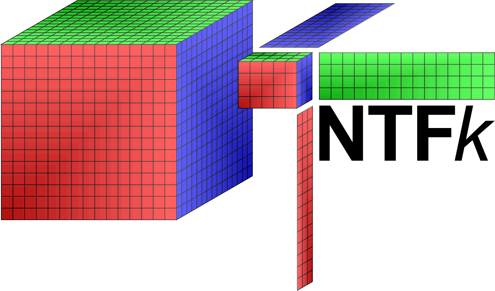

NTFk: Nonnegative Tensor Factorization + custom k-means clustering
===============



[![][gitlab-img]][gitlab-url] [![][codecov-img]][codecov-url]

[gitlab-img]: https://gitlab.com/TensorFactorization/NTFk.jl/badges/master/pipeline.svg
[gitlab-url]: https://gitlab.com/TensorFactorization/NTFk.jl/pipelines

[codecov-img]: https://gitlab.com/TensorFactorization/NTFk.jl/badges/master/coverage.svg
[codecov-url]: https://gitlab.com/TensorFactorization/NTFk.jl

Documentation
===============


Installation
============

After starting Julia, execute:

```
import Pkg; ("NTFk")
```

Installation behind a firewall
------------------------------

Julia uses git for package management. Add in the `.gitconfig` file in your home directory:

```
[url "https://"]
        insteadOf = git://
```

or execute:

```
git config --global url."https://".insteadOf git://
```

Set proxies:

```
export ftp_proxy=http://proxyout.<your_site>:8080
export rsync_proxy=http://proxyout.<your_site>:8080
export http_proxy=http://proxyout.<your_site>:8080
export https_proxy=http://proxyout.<your_site>:8080
export no_proxy=.<your_site>
```

For example, if you are doing this at LANL, you will need to execute the
following lines in your bash command-line environment:

```
export ftp_proxy=http://proxyout.lanl.gov:8080
export rsync_proxy=http://proxyout.lanl.gov:8080
export http_proxy=http://proxyout.lanl.gov:8080
export https_proxy=http://proxyout.lanl.gov:8080
export no_proxy=.lanl.gov
```

Publications, Presentations, Projects
=====================================

* [monty.gitlab.io](monty.gitlab.io)
